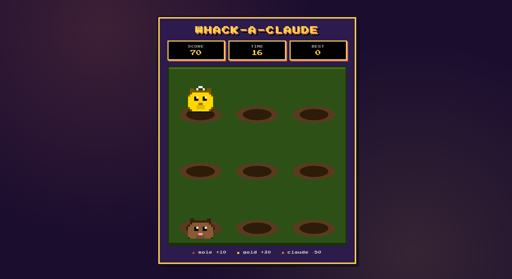
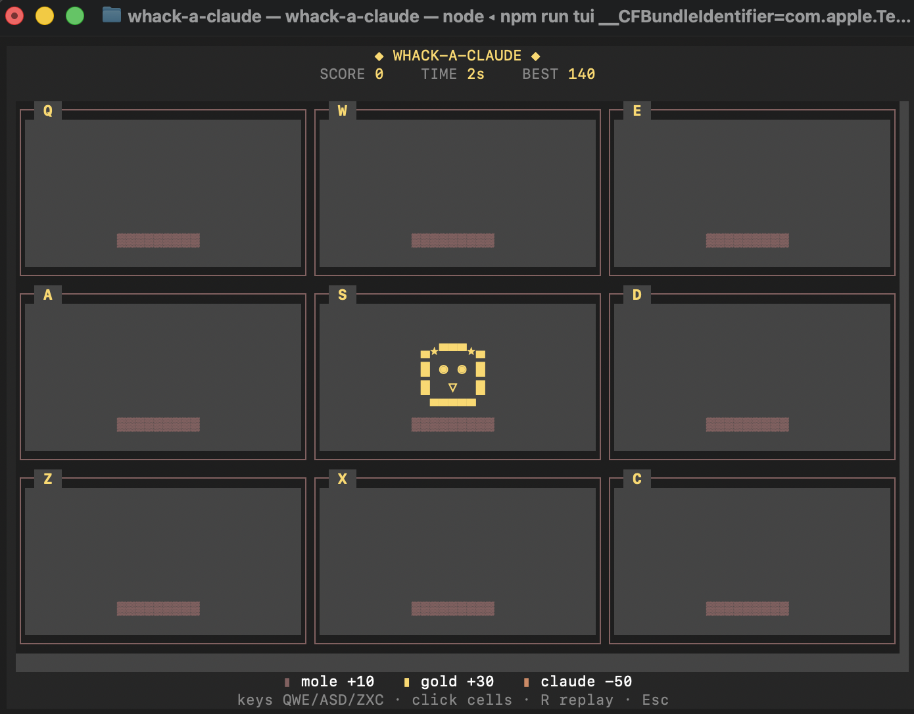

<h1 align="center">whack-a-claude</h1>

<p align="center">
  <b>The arcade game that pops up when Claude is taking too long.</b>
</p>

<p align="center">
  
  
  
</p>

<p align="center">
  
</p>

---

Claude taking more than 8 seconds to respond? A small picker pops up — **Skip / TUI / Browser** — and the game opens in whatever you choose. Don't pick? It vanishes after 12s. Claude finishes mid-game? The game closes itself. Fast turns never see anything.

Two playable modes — **browser** (pixel-art HTML game) and **terminal** (full TUI in your shell).

## Install

As a Claude Code plugin:

```bash
git clone https://github.com/ChenJiangxi/whack-a-claude ~/.claude-plugins/whack-a-claude
claude plugin install ~/.claude-plugins/whack-a-claude
```

That's it. Next slow Claude turn → game opens.

## Modes

### Browser

Auto-launches 8s after a slow turn starts and auto-closes when Claude is done. Pixel SVG sprites, squish/bonk animations, score pop-ups, persistent best score.

### Terminal

```bash
npm install && npm run tui
```

Full-screen `blessed` TUI. Mouse and keyboard both work — `Q W E / A S D / Z X C` maps your keyboard's left-hand 3×3 onto the grid, so hand position matches grid position with zero translation.

<p align="center">
  
</p>

## Scoring

| target | points |
| --- | ---: |
| brown mole | **+10** |
| gold mole  | **+30** |
| Claude     | **−50** *(don't.)* |

60-second round. Difficulty ramps from chill to frantic across the round. Best score persists at `~/.local/share/whack-a-claude/best`.

## How it works

```
UserPromptSubmit hook  →  status.json: "thinking"  +  schedule picker in 8s
Stop hook              →  status.json: "done"      +  cancel pending picker/game
```

Fast turn: cancel fires before the picker does, you see nothing. Slow turn: native macOS dialog pops with **Skip / TUI / Browser**; pick one and the chosen game opens; ignore it for 12s and it dismisses itself. Game polls `/status`, shows a "Claude's done" overlay when Claude finishes, auto-closes after 10s.

## Configure

| env var | default | what it does |
| --- | --- | --- |
| `WHACK_MODE` | `ask` | `ask` (per-turn picker) · `browser` (auto-open browser, no prompt) · `tui` (auto-open terminal, no prompt) · `off` (kill switch) |
| `WHACK_DELAY` | `8` | seconds Claude has to finish before the picker appears |
| `WHACK_ASK_TIMEOUT` | `12` | seconds the picker waits before auto-Skipping |
| `WHACK_DISABLE` | `0` | set to `1` to disable hooks entirely (same as `MODE=off`) |
| `WHACK_PORT` | `7654` | local server port (browser mode only) |

**Quick on/off without editing env** — `touch ~/.whack-off` to silence both hooks instantly; `rm ~/.whack-off` to bring the game back. No restart needed.

**Trigger condition** — picker appears when Claude takes longer than `WHACK_DELAY` seconds. Cancelled if Claude finishes first.

**Stay-quiet condition** — nothing pops when `~/.whack-off` exists, or `WHACK_MODE=off`, or `WHACK_DISABLE=1`. Set `WHACK_MODE=browser` or `tui` to skip the picker and auto-launch the same mode every time.

**Mode condition** — `WHACK_MODE=tui` launches the terminal version in a tmux split-pane (or a new Terminal.app window if not in tmux). Requires tmux for the cleanest experience.

## Run standalone (no Claude required)

```bash
npm install
npm start         # browser at http://127.0.0.1:7654
npm run tui       # terminal
```

## License

[MIT](LICENSE)
